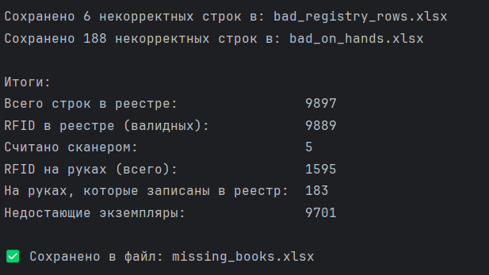
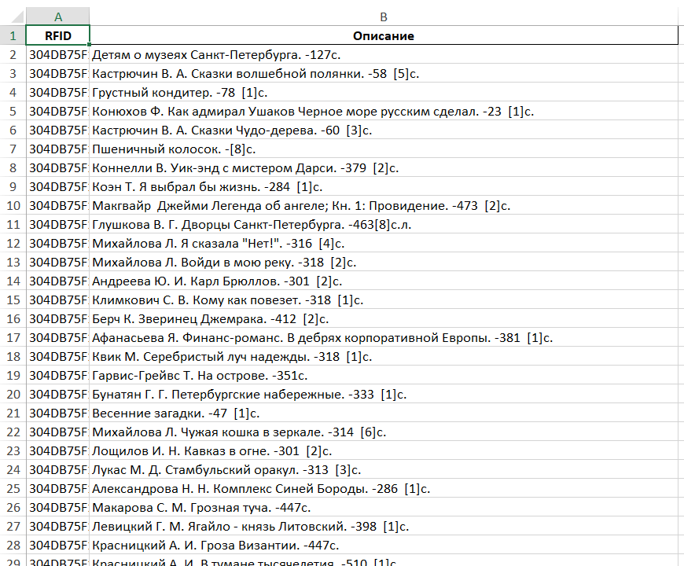
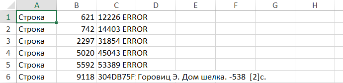
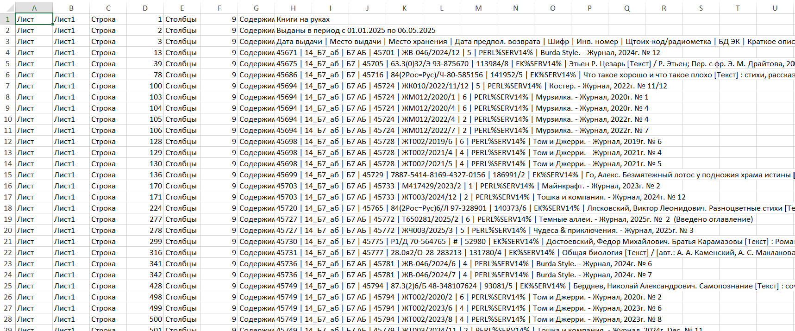

# 📚 Инвентаризация фонда библиотеки

Скрипт для автоматизированной проверки фонда на основе радиочастотных меток.  
Определяет отсутствующие книги, опираясь на сравнение каталога, книг на руках и данных ручного сканирования.

---

## 🔍 Описание

📖 **Что делает скрипт:**
- Загружает:
  - 📄 `list.txt` — файл со списком RFID-меток, считанных сканером
  - 📄 `Б7.csv` — полный реестр экземпляров книг в библиотеке
  - 📄 `Книги на руках Б7.xlsx` — выгрузка книг, выданных читателям
- Обрабатывает каждую строку независимо от структуры таблиц
- Ищет RFID по маске `304DB75F19600014XXXXXXXX`
- Логирует некорректные строки отдельно
- Выводит информацию о **недостающих книгах**
- Сохраняет результат в `missing_books.xlsx`

---

## 💾 Установка зависимостей

```bash
pip install -r requirements.txt
```

## 🧠 Логика
1. Все RFID метки ищутся по маске 304DB75F19600014******
2. Структура таблиц не важна: скрипт сканирует все ячейки во всех колонках
3. Пропущенные книги определяются как
```scss
Недостающие = Все из реестра - Считанные - Книги на руках
```
## 📸 Примеры работы скрипта

### 🖥️ Вывод в консоль

<p align="center">
  
</p>

---

### 📤 Результат: список утерянных книг

<p align="center">
  
</p>

> Сформированный Excel-файл `missing_books.xlsx` с RFID, инвентарными номерами и описанием книг, которых не хватает на полках.

---

### ⚠️ Некорректные строки в реестре

<p align="center">
  
</p>

> Строки из `Б7.csv`, где отсутствует RFID.

---

### ⚠️ Некорректные строки в выданных на руки

<p align="center">
  
</p>

> Строки из `Книги на руках Б7.xlsx`, в которых не удалось найти RFID-метку.

---
